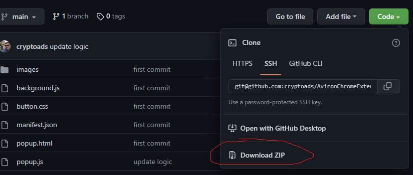
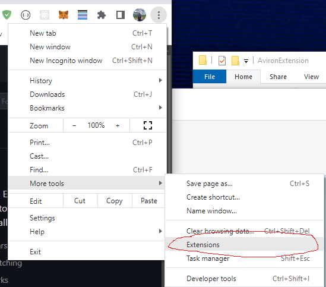
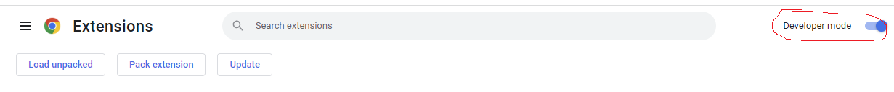
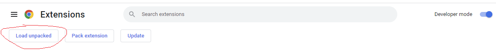
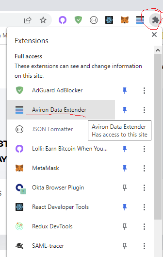
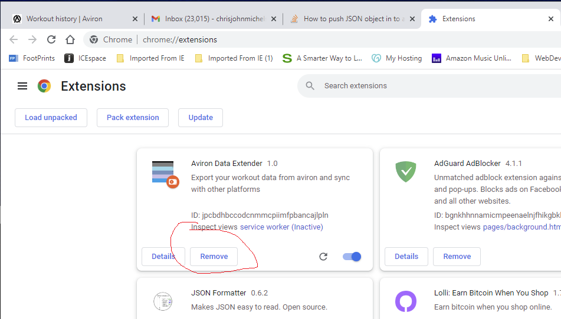

# Summary
This is v1.1 of an extension that I'm building to help integrate Aviron rower data with other platforms like Strava and Myfitness pal.  v1.1 ONLY ALLOWS FOR EXPORT TO CSV. External application integrations are planned for a later date.

## Installation 
Download the .zip containing the contents of this extension.

Unzip the contents wherever (you will need to navigate to this location to load the extension into chrome later)

Open your Chrome browser and navigate to the extensions settings

Enable developer mode 

Navigate to the unziped folder and load the extension. (When loding the extension, you only need to select the parent folder)

You should now see the extension in the extensions dropdown

## Update

If you need to update to the latest version, you can remove the old extension by going to the extension page and clicking remove and then following the installation instructions again.

## Usage
Navigate to your Aviron membership profile (https://accounts.avironactive.com/profile) and login.  You can then click the extension to export your workout data to CSV.  